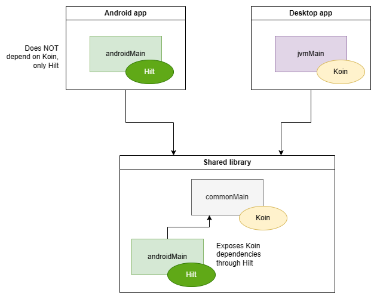

# KMP-shared-DI

Demonstrates mixing DI frameworks in Kotlin Multiplatform (KMP). This project uses Koin
in the shared code, but exposes it in the `androidMain` source set as a Hilt module. This allows
consumers on Android to inject the shared code in Hilt, without being forced to switch or even
depend on the DI framework the shared code is using.

## Architecture

### Running the app

#### Android
`gradlew android:installDebug`

#### Desktop
Click the ▶️ icon next to `fun main()` in `desktop/src/jvmMain/kotlin/Main.kt`.