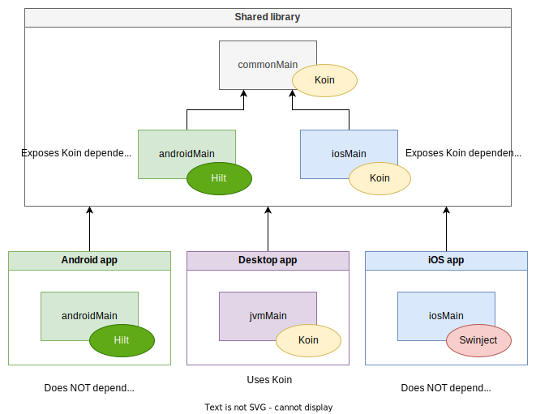

# KMP-shared-DI

Demonstrates mixing DI frameworks in a Kotlin Multiplatform (KMP) project: Koin, Dagger/Hilt and Swinject.

It uses Koin in the shared code, which is directly reused in the [desktop] sample. It exposes the dependencies in
the `androidMain` source set as a Hilt module for the [android] sample, so the Android app does
not have a dependency on Koin and can keep using Hilt and is not forced to switch DI framework.
The same goes for the [ios] sample, albeit a bit differently setup: the shared dependencies are
exposed through a `KoinComponent` in the `iosMain` source set, and the iOS app accesses those to
put them into the Swinject container.

## Architecture

### Running the app

#### Android
`gradlew android:installDebug`

#### Desktop
Click the ▶️ icon next to `fun main()` in `desktop/src/jvmMain/kotlin/Main.kt`.

#### iOS
Open the project in XCode and run it. It's pre-configured to first build the shared code
(see https://kotlinlang.org/docs/multiplatform-mobile-integrate-in-existing-app.html for instructions).